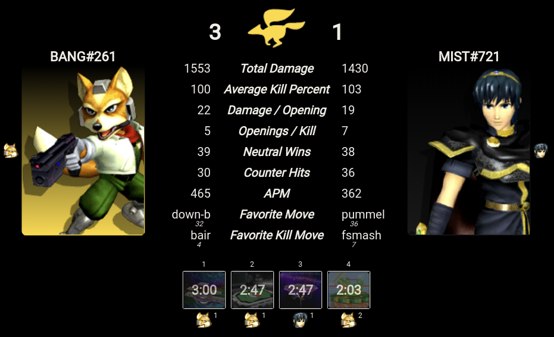

<p align="center">
  
</p>
<h1 align="center">Slippi Scripts</h1>

<div align="center">

A collection of Slippi scripts and other vaguely useful things.

[](https://github.com/IvantheTricourne/slippi-scripts/actions)
[](https://github.com/IvantheTricourne/slippi-scripts/blob/master/LICENSE.txt)
<a href="https://patreon.com/setBaNG"> </a>

</div>

## Features

<div align="center">

_Visualize game/set stats!_



_Many more in the making!_

</div>

## Download

Download for your operating system using the links below or check out [the releases page](https://github.com/IvantheTricourne/slippi-scripts/releases) for more information.

- [Windows](https://github.com/IvantheTricourne/slippi-scripts/releases/latest/download/Slippi-Scripts-GUI.exe)
- [MacOS](https://github.com/IvantheTricourne/slippi-scripts/releases/latest/download/Slippi-Scripts-GUI.dmg)
- [Linux](https://github.com/IvantheTricourne/slippi-scripts/releases/latest/download/Slippi-Scripts-GUI.AppImage)

Alternatively, you can clone this repo, then using [`yarn`](https://classic.yarnpkg.com/en/docs/install/):

```
yarn install
yarn run start
```

## Usage

* _Visualize game/set stats_:
  * The application launches in the "Home" screen
  * Click the smash logo labeled _Stats_ to launch a file selection window
    * _alternatively_, you may choose to click _Configure_ to select which stats you would like to view
  * In the file selection window, select one or more `.slp` files (i.e., use Shift + arrow keys or Shift + click)
  * The application will load and show the combined stats for the provided `.slp` files!
    * NOTE: At this screen, you may **double-click** anywhere in the center stats column to configure which stats to visualize!
  * To select a different set of files, click the golden center icon to return to the "Home" screen

## Development

```
yarn install
yarn run watch
```

This will launch an instance of the main app similar to the `start` command, except that any changes made in:

* `/src` (backend)
* `/gui` (frontend)

will magically refresh the app with the appropriate changes!

## Acknowledgements

* My girlfriend ❤️ [Lynne Fae](https://github.com/lynnefae) for her undying support and art contributions to this project
* [Jas Laferriere](https://github.com/JLaferri) and the [Project Slippi](https://github.com/project-slippi) team

